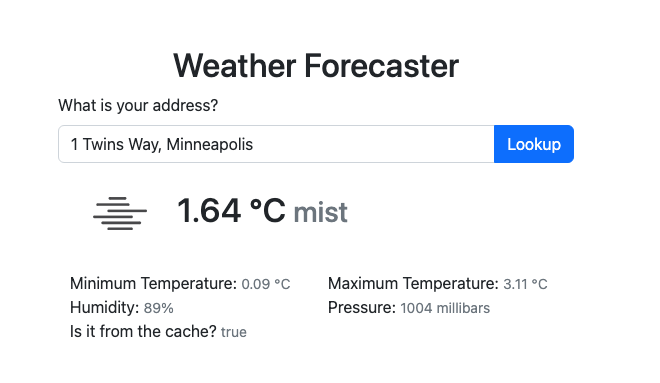

# Weather forecaster web application



## Coding Assignment - Requirements

* Must be done in Ruby on Rails
* Accept an address as input
* Retrieve forecast data for the given address. This should include, at minimum, the current temperature (Bonus points - Retrieve high/low and/or extended forecast)
* Display the requested forecast details to the user
* Cache the forecast details for 30 minutes for all subsequent requests by zip codes. Display indicator if result is pulled from cache.


## Set up Rails

This app is developed on a Mac OS.

* Ruby - 3.2.1
* Rails - 7.0.4.2

Install the latest ruby & rails using rbenv or asdf whatever you are familar with.


## Set up the app


### Create a new app

Create a new Ruby on Rails app and test it:

```sh
% rails new forecaster --skip-activerecord
% cd forecaster
% bin/rails test
% bin/rails server -d
```


### Add flash

Add flash messages that are rendered via a view partial:

```sh
% mkdir app/views/shared
```

Create `app/views/shared/_flash.html.erb`:

```ruby
<% flash.each do |type, message| %>
  <div class="<%= "#{type} #{type}-danger" %>" role="<%= type %>">
    <%= message %>
  </div>
<% end %>
```

### Add faker gem

To create test data, we can use the `faker` gem, which can create fake addresses.

Edit `Gemfile` and its `test` section to add the `faker` gem:

```ruby
gem "faker"
```

Run:

```sh
bundle
```

### Generate forecasts controller

Generate a forecasts controller and its tests:

```sh
% bin/rails generate controller forecasts show
```

### Set the root path route

Edit `config/routes.rb`:

```ruby
# Defines the root path route ("/")
root "forecasts#show"
```

## Get forecast data for the given address

There are many ways we could get forecast data. 

* We choose to convert the address to a latitude and longitude, by using the geocoder gem and the ESRI ArcGIS API available [here](https://developers.arcgis.com/sign-up/)

* We choose to send the latitude and longitude to the OpenWeatherMap API available [here](https://openweathermap.com)

* We choose to implement each API as an application service, by creating a plain old Ruby object (PORO) in the directory `app/services`

Run:

```sh
% mkdir -p {app,test}/services
% touch {app,test}/services/.keep
```


### Set ArcGIS API credentials

Edit Rails credentials:

```sh
EDITOR="code --wait"  bin/rails credentials:edit
```

Add your ArcGIS credentials by replacing these fake credentials with your real credentials:

```ruby
arcgis_api_user_id: test_user
arcgis_api_secret_key: 6d9ecd1c-2b00-4a0e-89d7-8f250418a9c4
```


### Add Geocoder gem

Ruby has an excellent way to access the ArcGIS API, by using the Geocoder gem, and configuring it for the ArcGIS API.

Edit `Gemfile` to add:

```ruby
# Look up a map address and convert it to latitude, longitude, etc.
gem "geocoder"
```

Run:

```sh
bundle
```


### Configure Geocoder

Create `config/initializers/geocoder.rb`:

```ruby
Geocoder.configure(
    esri: {
        api_key: [
            Rails.application.credentials.arcgis_api_user_id, 
            Rails.application.credentials.arcgis_api_secret_key,
        ], 
        for_storage: true
    }
)
```


### Create GeocodeService

We want to create a geocode service that converts from an address string into a latitude, longitude, country code, and postal code.

Create `test/services/geocode_service_test.rb`:

```ruby
require 'test_helper'

class GeocodeServiceTest < ActiveSupport::TestCase

  test "call geocoder with the Minneapolis address" do
    address = "1 Twins Way, Minneapolis"
    geocode = GeocodeService.call(address)
    assert_in_delta 44.98, geocode.latitude, 0.1
    assert_in_delta -93.27, geocode.longitude, 0.1
    assert_equal "55403", geocode.postal_code
  end

  test "call geocoder with the wrong address" do
    address = "malaysia"
    assert_raise StandardError do
      GeocodeService.call(address)
    end
  end

end
```

Create `app/services/geocode_service.rb`:

```ruby
class GeocodeService 

  def self.call(address)
    response = Geocoder.search(address)

    # validate the response data structure
    response or raise StandardError.new "Failed to get Geocoder response"
    response.length > 0 or raise StandardError.new "Geocoder is empty: #{response}"
    data = response.first.data
    data or raise StandardError.new "Geocoder data error"
    data["lat"] or raise StandardError.new "Geocoder latitude is missing"
    data["lon"] or raise StandardError.new "Geocoder longitude is missing"
    data["address"] or raise StandardError.new "Geocoder address is missing" 
    data["address"]["postcode"] or raise StandardError.new "Geocoder postal code is missing" 

    # build geocode data
    geocode = OpenStruct.new
    geocode.latitude = data["lat"].to_f
    geocode.longitude = data["lon"].to_f
    geocode.postal_code = data["address"]["postcode"]
    geocode
  end

end
```


## Join OpenWeather API

Sign up at <https://openweathermap.org>

* The process creates your API key.

Example:

* OpenWeather API key: 70a6c8131f03fe7a745b6b713ed9ebfd


### Set OpenWeather API credentials

Edit Rails credentials:

```sh
EDITOR="code --wait"  bin/rails credentials:edit
```

Add your OpenWeather credentials by replacing these fake credentials with your real credentials:

```ruby
openweather_api_key: 70a6c8131f03fe7a745b6b713ed9ebfd
```


### Add Faraday gems

Ruby has many excellent ways to do HTTP API requests. I prefer the Faraday gem because it tends to provide the most power and the most capabilities, such as for asynchronous programming.

Edit `Gemfile` and add:

```ruby
# Simple flexible HTTP client library, with support for multiple backends.
gem "faraday"
gem "faraday_middleware"
```

Run:

```sh
bundle
```


### Create WeatherService

Create `test/services/weather_service_test.rb`:

```ruby
require 'test_helper'

class WeatherServiceTest < ActiveSupport::TestCase

  test "call openweathermap with latitude and logitude parameters" do
    # Example address is 1 Twins Way, Minneapolis
    latitude = 44.98168445
    longitude = -93.27786434576453
    weather = WeatherService.call(latitude, longitude)
    assert_includes -4..44, weather.temperature
    assert_includes -4..44, weather.temperature_min
    assert_includes -4..44, weather.temperature_max
    assert_includes 0..100, weather.humidity
    assert_includes 900..1100, weather.pressure
    refute_empty weather.description
  end

end

```

Create `app/services/weather_service.rb`:

```ruby
class WeatherService
  
  def self.call(latitude, longitude)
    conn = Faraday.new('https://api.openweathermap.org') do |f|
      f.request :json # encode req bodies as JSON and automatically set the Content-Type header
      f.request :retry # retry transient failures
      f.response :json # decode response bodies as JSON
    end    

    # send request
    response = conn.get('/data/2.5/weather', {
      appid: Rails.application.credentials.openweather_api_key,
      lat: latitude,
      lon: longitude,
      units: "metric"
    })

    # validate the response data structure
    body = response.body
    body or raise StandardError.new "OpenWeather response body failed"
    body["main"] or raise StandardError.new "OpenWeather main section is missing"

    # build weather data
    weather = OpenStruct.new
    weather.name = body["name"]
    weather.temperature = body["main"]["temp"]
    weather.temperature_min = body["main"]["temp_min"]
    weather.temperature_max = body["main"]["temp_max"]
    weather.humidity = body["main"]["humidity"]
    weather.pressure = body["main"]["pressure"]
    weather.main = body["weather"][0]["main"]
    weather.description = body["weather"][0]["description"]
    weather.icon = body["weather"][0]["icon"]
    weather.dt = body["dt"]
    weather.visibility = body["visibility"]

    weather
  end
    
end
```
### Add Bootstrap gems

for UI, add Bootstrap gem

Edit `Gemfile` and add:

```ruby
# Bootstrap
gem 'bootstrap', '~> 5.2.2'
```

Run:

```sh
bundle
```

## Complete the app

In the interest of time, I'll complete the app by doing the forecasts controller and view. Use of TDD and/or step-by-step additions are shown above, so are elided below.


### Complete the forecasts controller


Complete `app/controllers/forecasts_controller.rb`:

```ruby
class ForecastsController < ApplicationController

  def show
    @address_default = "1 Twins Way, Minneapolis"

    if params[:address].present?
      begin
        @address = params[:address]
        @geocode = GeocodeService.call(@address)

        weather_cache_key = "#{@geocode.postal_code}"

        @weather_cache_exist = Rails.cache.exist?(weather_cache_key)

        @weather = Rails.cache.fetch(weather_cache_key, expires_in: 30.minutes) do
          WeatherService.call(@geocode.latitude, @geocode.longitude)          
        end
      rescue => e
        flash.alert = e.message
      end
    end
  end

end
```


### Complete the forecasts view

Complete `app/views/forecasts/show.html.erb`:


```erb
<%= render "shared/flash" %>

<%= form_with(method: 'get', local: true) do %>
	<%= label :address, "What is your address?", class: "form-label" %>
	<div class="input-group">
		<%= text_field_tag(:address, @address || @address_default, size: 70, placeholder: "Type address", class: "form-control") %>
		<%= submit_tag("Lookup", class: "btn btn-primary") %>
	</div>
<% end %>
<% if defined?(@weather) %>
	<div class="container">
		<div class="row">
			<div class="col">
				<h1>
					@2x.png">
					<%= @weather.temperature %> ℃
					<small class="text-muted"><%= @weather.description %></small>
				</h1>
			</div>
		</div>
		<div class="row">
			<div class="col">
				Minimum Temperature: <small class="text-muted"><%= @weather.temperature_min %> ℃</small>
			</div>
			<div class="col">
				Maximum Temperature: <small class="text-muted"><%= @weather.temperature_max %> ℃</small>
			</div>
		</div>
		<div class="row">
			<div class="col">
				Humidity: <small class="text-muted"><%= @weather.humidity %>%</small>
			</div>
			<div class="col">
				Pressure: <small class="text-muted"><%= @weather.pressure %> millibars</small>
			</div>
		</div>
		<div class="row">
			<div class="col">
				Is it from the cache? <small class="text-muted"><%= @weather_cache_exist %></small>
			</div>
		</div>
	</div>
<% end %>
```

Update `test/system/forecasts_test.rb`:

```ruby
assert_selector "h1", text: "Weather Forecaster"
```


### Enable the cache

Enable the Rails development cache, so a developer can see that the forecasts are cached as expected.


```sh
bin/rails dev:cache
```


## Conclusion

The app now works successfully:

```sh
% bin/rails test
% bin/rails test:system
% bin/rails server -d
```

Browse to <http://127.0.0.1:3000>

It's a simple weather forecaster Ruby on Rails project, Test Driven Development, API access using a specialized gem (i.e. geocoder) and a generalized gem (i.e. faraday).

